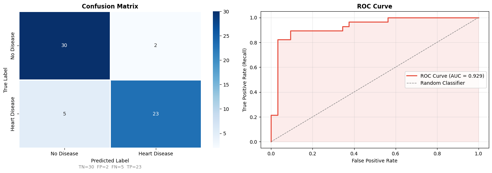
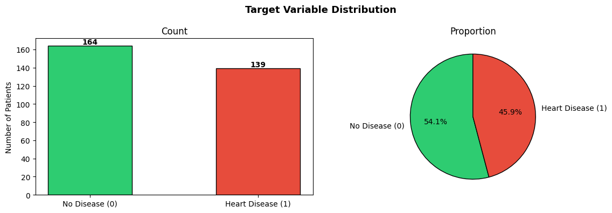
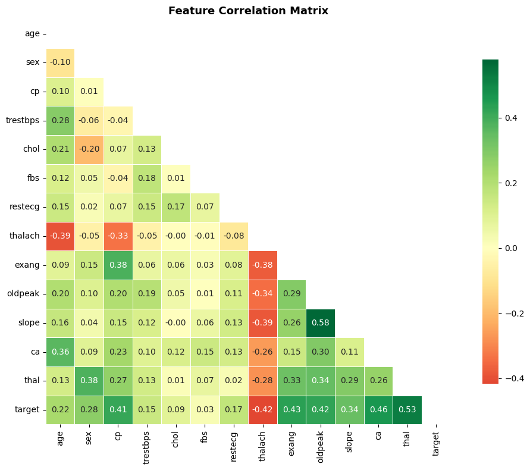
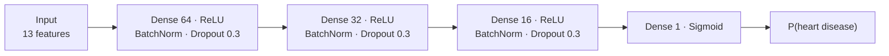
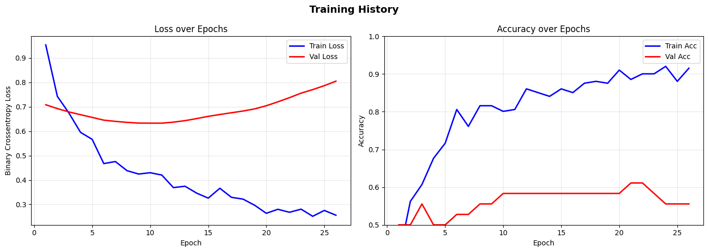
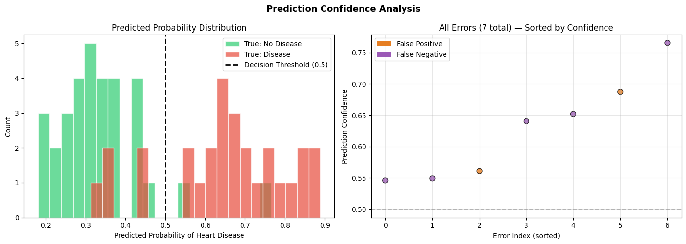

# 🧠 Deep Learning on Tabular Data — Heart Disease Prediction

[](https://colab.research.google.com/github/MMujtabaX/Deep-Learning/blob/main/deep_learning_tabular_codealong.ipynb)


A **dense neural network** that predicts heart disease from 13 clinical features. It covers the full workflow: loading real data from the UCI repository, EDA, leakage-safe preprocessing, a regularized network with **Batch Normalization, Dropout and Early Stopping**, and medically focused evaluation.

<p align="center">
  
</p>

## 📌 The Problem

The **UCI Heart Disease (Cleveland)** dataset has 303 patients with 13 features: age, sex, chest pain type, resting blood pressure, cholesterol, fasting blood sugar, resting ECG, max heart rate, exercise-induced angina, ST depression, ST slope, number of major vessels, and thalassemia.

The original target has 5 levels (0–4). It is converted to **binary**: 0 = no disease, 1 = heart disease.

## 🔄 Workflow

| Step | Stage | Details |
|------|-------|---------|
| 1 | Load | Fetched directly from UCI with `ucimlrepo`, so no manual download is needed |
| 2 | EDA | Class balance, statistical summary, correlation heatmap |
| 3 | Cleaning | Dropped 6 rows with missing `ca` / `thal` values → 297 patients |
| 4 | Split | Stratified 80/20 split → 237 train, 60 test |
| 5 | Scaling | `StandardScaler` fit on the **training set only** to prevent leakage |
| 6 | Model | Dense network with BatchNorm and Dropout |
| 7 | Training | Adam optimizer, binary cross-entropy, early stopping on validation loss |
| 8 | Evaluation | Confusion matrix, ROC curve, classification report, confidence analysis |
| 9 | Experiments | Configurable layers, activation, dropout, BatchNorm and threshold |

<table>
  <tr>
    <td></td>
    <td></td>
  </tr>
  <tr>
    <td align="center"><b>Fairly balanced classes: 160 healthy vs 137 with disease</b></td>
    <td align="center"><b>Feature correlations with the target</b></td>
  </tr>
</table>

## 🧱 Network Architecture



**3,713 trainable parameters.** Batch Normalization stabilizes training, and Dropout reduces overfitting, which matters on a dataset this small.

## 🏋️ Training

<p align="center">
  
</p>

Early stopping (patience 15) halted training at epoch 26 and **restored the best weights from epoch 11**. Training accuracy kept rising after that while validation performance declined: the network was starting to memorize the small training set, and early stopping prevented it.

## 📊 Results

Evaluated on **60 unseen patients**:

| Metric | No Disease | Heart Disease |
|--------|------------|---------------|
| Precision | 0.86 | **0.92** |
| Recall | **0.94** | 0.82 |
| F1-score | 0.90 | 0.87 |

| Overall | Score |
|---------|-------|
| **Accuracy** | **88.3%** |
| **ROC-AUC** | **0.929** |

**Confusion matrix:** 30 true negatives, 23 true positives, 2 false positives and **5 false negatives**.

### Why false negatives matter

A false negative is a sick patient sent home as healthy, which is the most dangerous error in a medical setting. With 82% recall, the model misses about 1 in 5 disease cases. **Lowering the decision threshold** from 0.5 would catch more cases at the cost of more false alarms. The notebook's Experiment Zone lets you test this directly.

<p align="center">
  
</p>

## 🔬 A Note on Variance

A second run of the **same architecture** in the Experiment Zone scored **81.7% accuracy (ROC-AUC 0.919)**, compared with 88.3% in the main run. With only 60 test patients, each misclassified patient moves accuracy by about 1.7 points, and different random initializations give noticeably different results. ROC-AUC was far more stable than accuracy (0.93 vs 0.92). **Cross-validation over multiple seeds** would give a more trustworthy estimate.

## 💡 Key Takeaways

- **Always scale tabular features** for neural networks, and fit the scaler on training data only.
- **Early stopping with `restore_best_weights`** is a simple, effective defence against overfitting.
- **For medical problems, recall matters more than raw accuracy.**
- **On small tabular datasets, deep learning has no automatic advantage.** Classical models like Logistic Regression or Random Forest often match it.

## 🚀 Run It

Click the **Open in Colab** badge above, or run it locally:

```bash
pip install tensorflow ucimlrepo scikit-learn pandas numpy matplotlib seaborn jupyter
jupyter notebook deep_learning_tabular_codealong.ipynb
```

The dataset downloads automatically from the UCI repository.

## 🔮 Next Steps

- Compare against Logistic Regression, Random Forest and XGBoost on the same split
- One-hot encode categorical features (`cp`, `thal`, `slope`, `restecg`)
- Stratified k-fold cross-validation across multiple random seeds
- Hyperparameter search with `keras_tuner`

## 👤 Author

**Muhammad Mujtaba Khan Suri** — CS @ UBIT, University of Karachi
[GitHub](https://github.com/MMujtabaX)
